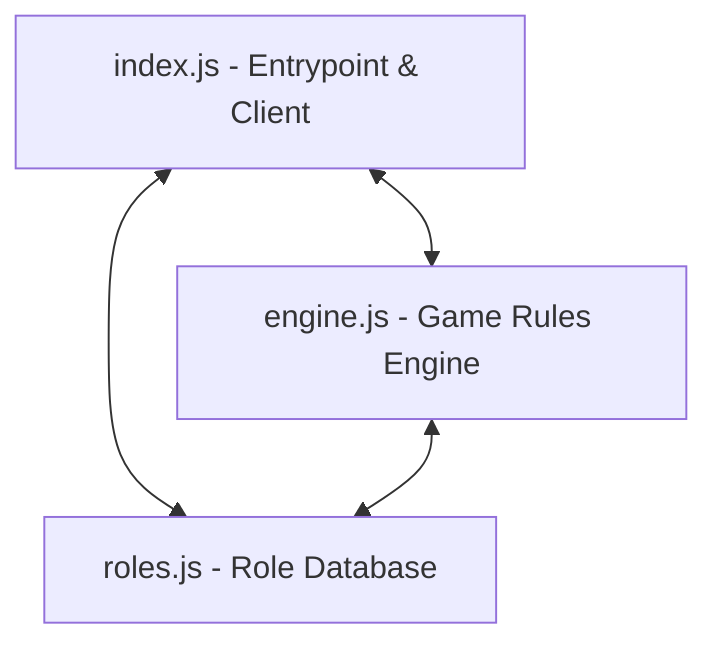

# Town of Charlotte Bot 🏰🕵️‍♂️

**Town of Charlotte** is a Discord bot designed to act as the automated Gamemaster for a social deduction game based on the rules of *Town of Salem*. 

It manages game lobbies, randomly assigns player roles based on player count, coordinates secret nighttime actions via Direct Messages, resolves complex action priority queues, and checks win conditions—all directly inside your Discord server.

---

## 🛠️ Codebase Architecture

The codebase is modernized to use **Discord.js v14** and **Node.js 18+**. The logic is cleanly split into three main modules:



### 1. `index.js` (The Controller)
The main entry point of the bot. It:
* Initializes the Discord Client, configures Gateway Intents (Guilds, Members, Messages, Message Content, DMs, Reactions), and logs in.
* Manages the global state of the active game session (lobby queue, players, night action submissions, pending actions list, and doused/blackmailed statuses).
* Listens to and routes public guild commands (prefixed by `.`) and private DMs (`.action`).
* Coordinates channel setup (such as creating/deleting the private `#mafia-chat` channel) and manages player roles.

### 2. `engine.js` (The Game Rules Engine)
Contains pure javascript logic functions that do not directly depend on the Discord Client state:
* **`assignRoles(alivePlayers)`**: Dynamically builds the game roster based on the number of players (7 to 20), selects roles from various categories (Town Protective, support, killing, investigative, Mafia, Neutral), shuffles them, and assigns them to the players.
* **`resolveNight(game, dmUser)`**: Resolves all night actions in strict priority order (see [Night Resolution Pipeline](#night-resolution-pipeline) below). It calculates who gets role-blocked, healed, protected, attacked, cleaned, blackmailed, or successfully investigates targets, then returns public announcement logs and updates the game state.
* **`checkWinConditions(game)`**: Analyzes the surviving players at the end of each day/night and determines if the game should end (Town win, Mafia win, Neutral solo win, or a Draw).

### 3. `roles.js` (The Role Database)
Acts as the single source of truth for role configurations. Each role details:
* Description (`txt`) and investigative clues (`looksLike`).
* Night action priority level (`priority`).
* Abilities (`abilities`) and their limit on uses (`uses`).
* Defensive properties and block/detection immunities (`immunity`).
* Win conditions (`wins`, e.g., 'town', 'mafia', 'neutral').
* Night behavior parameters (`canTargetSelf`, `canSleep`, `actsPerNight`, etc.).

---

## ⚙️ Gameplay & Phase Loop

### 1. Lobby & Setup
* A user with the **Gamemaster** role opens a lobby using `.game queue`.
* Players join using `.game join`. The bot assigns the **Playing Game** role to them.
* The Gamemaster starts the game with `.game start` (requires 7–20 players).
* Roles are secretly distributed to players via DMs, and a private `#mafia-chat` channel is created dynamically for the Mafia team.

### 2. The Night Phase
* The Gamemaster starts the night phase using `.night start`.
* The bot waits for all players with active abilities to DM `.action <ability> <target>` or `.action sleep`.
* **Night Resolution Pipeline**:
  When all actions are submitted (or when the GM forces resolution via `.night end`), actions are sorted and executed in order of priority:
  1. **Investigative** (Sheriff, Investigator, Lookout, Consigliere)
  2. **Jail** (Jailor locks up a player, protecting them but role-blocking them)
  3. **Role-Block** (Comedian, Hypnotist block actions)
  4. **Protective** (Doctor heals, Bodyguard guards, Survivor vests)
  5. **Killing** (Mafia, Serial Killer, Vigilante, Werewolf, Arsonist ignite, Terrorist)
  6. **Misc Actions** (Arsonist douses, Blackmailer blackmails, Cleaner cleans, Amnesiac remembers)
* The bot evaluates target immunities, healing status, and Bodyguard intercepts to determine deaths.

### 3. The Day Phase
* Morning reports announce deaths and causes.
* The town engages in open discussion. Blackmailed players have their messages silently deleted and cannot speak.
* **Lynching is two-phase:**
  1. **Nomination** — any player runs `.lynch` to open a reaction poll. Players react or use `.vote <name>` to nominate a suspect.
  2. **Final Vote** — the GM runs `.lynch close` to move the top nominee onto the lynching block. A ✅/❌ embed is posted, requiring **⅔ of the town** to pass. The GM tallies with `.lynch tally`.
* Only **one lynch per day** is permitted. Lynching is not allowed on Day 1.
* If a **Lunatic** is successfully lynched, they immediately win — but the game continues for the remaining factions.
* If the **Godfather** is lynched or killed at night, the living Mafioso is automatically promoted to Godfather.
* Win conditions are evaluated immediately following any player death. If a faction wins, the bot reveals all roles, removes the **Playing Game** role from players, deletes the `#mafia-chat` channel, and resets state.

---

## 🚀 Setting up in the Cloud

This repository is pre-configured to be deployed easily to cloud platforms (such as Heroku, Render, Railway, or a VPS).

### 1. Create a Discord Application
1. Go to the [Discord Developer Portal](https://discord.com/developers/applications).
2. Create a **New Application** and add a **Bot** to it.
3. Under the **Bot** tab, enable the following **Privileged Gateway Intents**:
   * Presence Intent
   * Server Members Intent
   * Message Content Intent (Crucial for reading commands)
4. Generate a bot token and copy it.

### 2. Local Configuration & Testing
1. Clone the repository.
2. Run `npm install` to install dependencies (`discord.js`, `dotenv`).
3. Create a `.env` file in the root directory:
   ```env
   BOT_TOKEN=your_discord_bot_token_here
   ```
4. Start the bot locally in development mode:
   ```bash
   npm run dev
   ```

### 3. Deploying to the Cloud
* **`Procfile`**: The project includes a `Procfile` configured with `worker: node index.js` for Heroku or Render native background workers.
* **Environment Variables**: Make sure to set `BOT_TOKEN` as a config var/environment variable in your cloud dashboard.
* **Dependencies**: Cloud platforms will automatically detect `package.json` and install the correct Node dependencies.

---

## 💬 Server Setup & Command List

### 1. Server Prerequisites
The bot requires two roles to exist in the guild to function properly:
1. **`Gamemaster`**: Assigned to the user managing the lobby and phases.
2. **`Playing Game`**: Assigned dynamically by the bot to current lobby players to manage permissions.

Additionally, the bot must have permissions to:
* **Manage Channels** (to create and destroy `#mafia-chat`).
* **Manage Roles** (to add and remove `Playing Game`).
* **View Channels / Send Messages / Read Message History / Embed Links**.

### 2. Public Server Commands

| Command | Allowed Users | Description |
| :--- | :--- | :--- |
| `.help` | All | Responds via private DM with all general, game, and DM commands. |
| `.help roles list` | All | Responds via private DM with a list of all game roles. |
| `.help roles <role>` | All | Responds via private DM with a short summary of how the role works. |
| `.info` | All | Provides rules of the Town of Charlotte game. |
| `.roles` | All | Lists all roles. Use `.roles <name>` to see specific details. |
| `.settings` | All | Views the current bot and gameplay settings (only when no game is active). |
| `.settings public-results <on/off>` | All | Changes whether night results are posted in the channel or DMed secretly to the GM. |
| `.game queue` | Gamemaster | Creates a new game lobby and registers the GM. |
| `.game join` | All | Joins the current queued lobby. |
| `.game leave` | All | Leaves the lobby (or abandons the game if already started). |
| `.game start` | Gamemaster | Distributes roles, creates private channels, and starts the game. |
| `.game players` | All | Lists currently alive and dead players. |
| `.game end` | Gamemaster | Forces the current game to immediately end and resets state. |
| `.night start` | Gamemaster | Begins the night phase. |
| `.night end` | Gamemaster | Force-ends the night and resolves pending actions. |
| `.lynch` | All (day only, Day 2+) | Opens a nomination poll. React with the number emoji or use `.vote <name>` to nominate. |
| `.lynch close` | Gamemaster | Closes nominations. The top-voted nominee goes on the lynching block and a ✅/❌ vote is posted. |
| `.lynch tally` | Gamemaster | Tallies the final ✅/❌ vote. Lynch requires ⅔ of the town (yes votes). |
| `.vote <name>` | All | Text-based nomination during the nomination phase. |
| `.vote yes` / `.vote no` | All | Text-based vote during the final lynch vote (alternative to reacting). |
| `.admin restart` | Gamemaster | Re-logins the bot client. |
| `.admin add-players <n>`| Gamemaster | Adds `n` virtual players for lobby testing. |

### 3. Private DM Commands

Players send commands to the bot's DMs during the Night Phase:

| Command | Description |
| :--- | :--- |
| `.action <ability> <target>` | Perform your role's ability on a specified player (e.g. `.action heal Alice`). |
| `.action sleep` | Skip your action for tonight (only works if your role has `canSleep: true`). |
| `.help` | Sends the general command help menu. |
| `.help roles list` | Shows a list of all game roles. |
| `.help roles <role>` | Gets details, immunities, and abilities of a specific role. |
| `.game roles` | Shows a list of all game roles. |
| `.game role <name>` | Gets details, immunities, and abilities of a specific role. |
